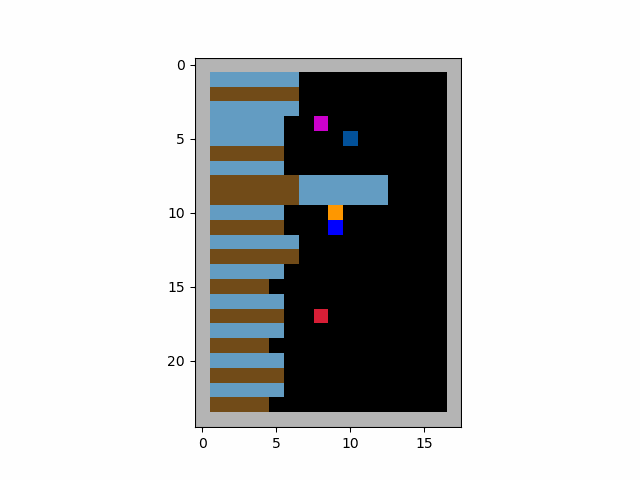

# Simulating Human Cooperation through Inequity Aversion: An Agent-Based Approach to Dynamic Social Dilemmas

**Candidate Number:** 31326

**Capstone Project**  
Submitted to the Department of Methodology  
at the London School of Economics and Political Science  
in partial fulfilment of  
MSc in Applied Social Data Science

## Overview

This repository contains the code and resources for the capstone project titled *Simulating Human Cooperation through Inequity Aversion: An Agent-Based Approach to Dynamic Social Dilemmas*. The project explores how inequity aversion, a social preference where agents dislike unequal outcomes, influences cooperation in simulation of human cooperation in multi-agent reinforcement learning (MARL) environments. The study uses Proximal Policy Optimization (PPO) to train agents in environments designed to mimic real-world social dilemmas, such as the Cleanup and Harvest games.

## A Example from the Result
Training five PPO agents with the advantageous inequality aversion reward leads to a clear emergence of division of labor and coordination (turn-taking).



## Key Features

- **Multi-Agent Environment:** The environments simulate complex social dilemmas using partially observable Markov games on a 2D grid. Agents interact and must balance individual rewards with collective benefits.
- **Proximal Policy Optimization (PPO):** PPO serves as the core algorithm, offering stable policy updates through a clipped surrogate objective, ensuring agents learn effective strategies for cooperation and resource management.
- **Inequity Aversion:** Agents are modeled with either advantageous or disadvantageous inequity aversion to examine how these traits impact their ability to cooperate and manage shared resources.
- **K-Step Return Calculation:** The advantage function in PPO is computed using k-step returns, which consider future rewards over multiple time steps, providing a balanced view of short-term and long-term incentives.

## Setup
* **Python version**. For meltingpot support, you need to install `python 3.11` or newer.

* **Packages**. You just need install the latest version of following packages: `pytorch`,`numpy`,`gymnasium`,`pettingzoo`,`wandb`,`matplotlib`,`opencv-python`.
For meltingpot, you need install meltingpot according to <https://github.com/google-deepmind/meltingpot>.
## Main Components
### `\ssd_pettingzoo`
This folder contains the CleanUp and Harvest environments as well as components supporting multithreading.

### `\data`
A copy of the data is also available in the `data` directory. The data is stored in the `csv` format.

### `\figures`
This folder contains the figures generated in the analysis and used in the dissertation.

### `main_ppo_clean_up.py`
This file hosts the implementation for training the CleanUp environment utilizing independent PPO 

### `main_ppo_harvest.py`
This file hosts the implementation for training the Harvest environment utilizing independent PPO 

### `ppo_agent.py`
Implementation of PPO, supporting CNN and RNN.

### `normalization.py`
Normalization class.

### `replaybuffer.py`
Implementation of a vectorized experience replay buffer.

### `utils.py`
Some utils.

## Usage
To train 5 baseline agents in the CleanUp environment, run the following command:
```bash
bash train_classic_clean_up.sh
```
To train 5 baseline agents in the Harvest environment, run the following command:
```bash
bash train_classic_harvest.sh
```
To train 5 agents with inequity aversion in the CleanUp environment, run the following command:
```bash
bash train_classic_clean_up_inequity_averse.sh
```
To train 5 agents with inequity aversion in the Harvest environment, run the following command:
```bash
bash train_classic_harvest_inequity_averse.sh
```


## Acknowledgements
The implement of PPO references the repository https://github.com/Lizhi-sjtu/MARL-code-pytorch.

The support tools of MeltingPot 2.0 are from https://github.com/rstrivedi/Melting-Pot-Contest-2023.
